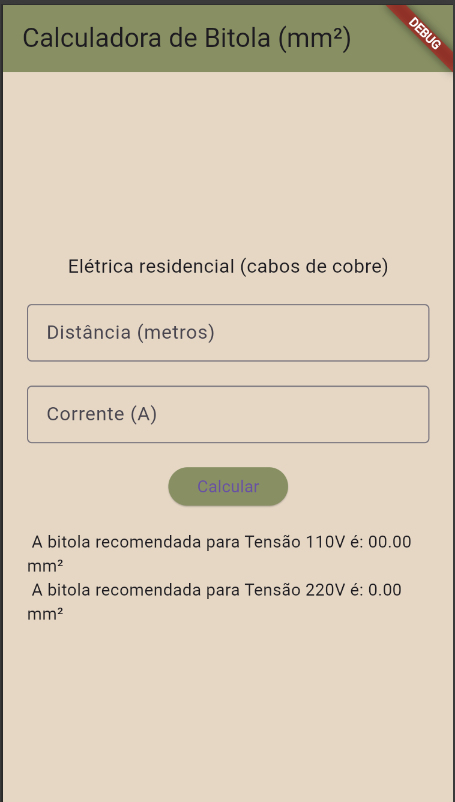
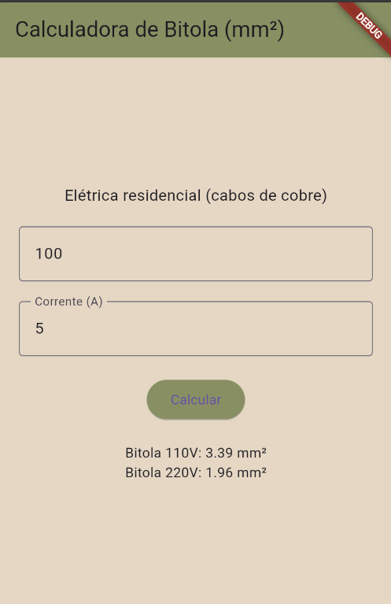

#  Atividade Flutter - Calculadora de Bitola (mm²)

Projeto básico desenvolvido em Flutter com o objetivo de aprender conceitos iniciais de desenvolvimento mobile, criando uma calculadora de bitola de cabos elétricos para instalações residenciais.

---

## 📱 Funcionalidades
- Cálculo da bitola para redes 110V
- Cálculo da bitola para redes 220V
- Entrada de distância e corrente elétrica
- Exibição dos resultados de forma simples
- Interface intuitiva

---

##  Prints do App

<p align="center">
  
  
</p>

---

##  Tecnologias Utilizadas
- Flutter
- Dart
- VS Code
- Android Studio

---

#  Passo a passo
- Clone este repositório
- Abra com VS Code
- Em um terminal digite:

```bash
flutter pub get
flutter run